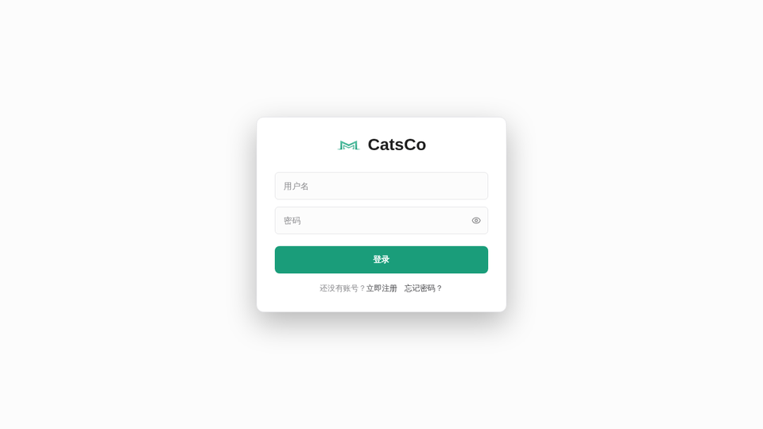
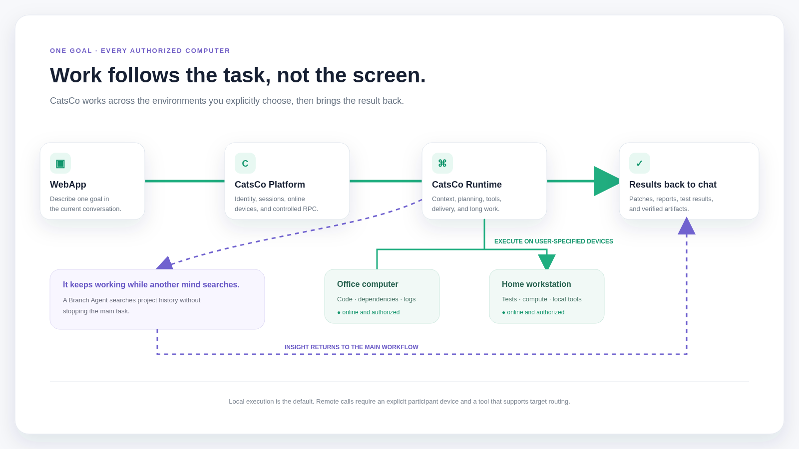

<div align="center">

# CatsCo

## Your AI employee, working across every computer you authorize.

把 AI 员工部署在云端、服务器或你的电脑上。

从 WebApp 或聊天中交代目标，让它在你明确指定、当前在线且已授权的设备上工作，并把结果带回当前会话。

**不是远程桌面。不是绑定在一台电脑上的助手。**

**而是一个能够跨越授权环境完成真实工作的 AI 员工。**

[一个真实任务](#一个任务多台电脑) · [快速开始](#快速开始) · [系统架构](#两座仓库一套产品) · [CatsCo Platform](https://github.com/buildsense-ai/cats-company)

[](https://github.com/buildsense-ai/XiaoBa-CLI/releases)
[](LICENSE)
[](https://github.com/buildsense-ai/XiaoBa-CLI/releases)

</div>

<p align="center">
  
</p>

---

## One employee. Every authorized computer.

真实工作很少只存在于一台电脑里。

代码在公司电脑，个人项目在家里的工作站，服务运行在云端，任务却可能来自手机上的 WebApp。

CatsCo 让同一个 AI 员工跨越这些授权环境工作：

- 在云端持续在线、接收任务和组织工作。
- 在公司电脑读取项目、日志和本地开发环境。
- 在家用工作站运行构建、测试或本地模型。
- 从指定设备导入文件，再把结果和产物送回当前会话。

设备不再只是一块需要人远程进入的屏幕，也可以成为 AI 按任务调用的工作资源。

### Remote control, redesigned for AI work

传统远程控制以“人进入另一块屏幕”为中心。

CatsCo 以“工作应该在哪个授权环境中发生”为中心。用户描述目标并明确指定设备，Runtime 调用该环境中的文件、Shell、浏览器和本地工具，完成后把结果带回对话。

这不是把整台电脑交给模型，也不是无限制的自动选机。

未指定目标时，工具只在 AI 员工的宿主环境运行；只有用户明确要求操作某位参与者的电脑，而且工具支持远程目标时，调用才会被路由到该用户当前在线的设备。

---

## 一个任务，多台电脑

你在回家的路上，通过手机 WebApp 发来一句话：

> 读取我公司电脑上的构建日志，把项目修好；改完后，到我家里的工作站运行完整测试，最后把补丁和报告发给我。

当相关设备都已安装 Runtime、完成登录与机器人绑定并保持在线时，CatsCo 可以按你的指定推进：

<p align="center">
  
</p>

你不需要依次登录多台电脑，也不需要手工搬运文件和上下文。

对用户而言，这仍然是一个任务、一个员工和一个对话。设备选择、连接状态、工具执行和结果交付由系统在授权边界内协同完成。

---

## Shared intelligence. Private workspaces.

同一个 CatsCo 员工可以出现在 WebApp、好友会话或群聊中，为不同用户工作。

它共享同一套模型能力、工具和长期工作方法，但每个请求仍受自己的身份、会话与设备边界约束。

```text
Shared
模型能力 · 工具 · 工作方法 · 可复用经验

Private
用户身份 · 会话上下文 · 授权设备 · 本地文件 · 执行环境
```

Platform 为实时消息提供当前参与者、会话和在线设备信息。Runtime 只根据当前请求解析目标。

共享同一个 Bot，不等于共享设备权限。

好友关系或群聊成员关系，也不等于获得其他人的电脑权限。

一个员工可以服务多人，但不会因此把不同用户的工作环境混在一起。

---

## It keeps working while another mind searches.

复杂任务经常在开始后才发现：关键线索可能藏在几天前的对话、一次失败的工具调用，或某个已经被遗忘的决定里。

CatsCo 不需要停下当前工作再回头翻找。

Branch Agent 在隔离的上下文中异步搜索历史会话、旧决策和工具结果；主 Agent 继续读取文件、修改代码或准备交付。搜索完成后，相关结论以临时 observation 回到当前工作流。

```text
主 Agent
继续当前任务 ───────────────────────────────→ 交付结果
      │
      └── Branch Agent
          搜索历史 · 提炼线索 · 返回 observation
```

Branch 拥有独立消息、工具、日志和取消信号，不把搜索过程直接写进父会话。

当前已经落地的具体实现是跨会话历史搜索。分支结果也会受到时效、取消与抑制规则约束，而不是无条件写回主线。

---

## From completed work to reusable skills.

一次交付不应只停留在历史记录里。CatsCo 会从真实工作中提取可复用经验，并通过证据、独立审查和审计记录，将它沉淀为可持续改进的 Skill。

这意味着 AI 员工不只是完成任务，也会把做对过的事情变成下一次更可靠的起点。能力演进遵循可追踪、可审查、可回滚的边界，而不是让 Agent 无限制地修改自己。

## 两座仓库，一套产品

CatsCo 当前由两个高度协作、开发边界清晰的开源仓库组成。

### CatsCo Platform

[buildsense-ai/cats-company](https://github.com/buildsense-ai/cats-company)

用户与设备的产品入口和协作控制面：

- WebApp 与服务端。
- 身份、消息、好友、群聊与会话。
- 设备登记、在线状态和工具 RPC 转发。
- Bot SDK、协议模型与部署配置。

Platform 负责让系统知道：谁在发起任务、消息属于哪个会话、哪个 Bot 接收任务，以及当前有哪些参与者设备在线。

### CatsCo Runtime

[buildsense-ai/XiaoBa-CLI](https://github.com/buildsense-ai/XiaoBa-CLI)

本仓库提供 AI 员工的运行与执行环境：

- Agent Runtime、模型适配和持久会话。
- CLI、Dashboard 与 Electron 桌面端。
- 文件、Shell、浏览器和本地工具。
- CatsCo WebApp Connector。
- Branch Agent、Skill Evolution 与 SkillHub。
- 微信、飞书等渠道适配。

Runtime 负责理解任务、构建上下文、编排工具、连接授权设备并完成交付。

### Connector 是 Runtime 的一种运行模式

Connector 目前不是第三个独立仓库或独立下载包。

设备安装本仓库、通过 Dashboard 完成登录与机器人绑定后，运行 `node dist/index.js connect` 建立 CatsCo WebSocket 连接。连接期间，该设备可以响应支持远程路由的工具请求。

简单来说：Platform 负责身份、消息和实时设备信息；主 Runtime 负责思考与编排；目标设备上的 Connector 负责在本地执行被允许的工具。

---

## 快速开始

### 本地运行

需要 Node.js 18 或更高版本与 Git。

```bash
git clone https://github.com/buildsense-ai/XiaoBa-CLI.git
cd XiaoBa-CLI
npm install
npm run build
node dist/index.js config
node dist/index.js chat --interactive
```

本地 Agent 不要求部署 CatsCo Platform。

### 连接 CatsCo Platform

```bash
node dist/index.js dashboard
```

打开 `http://localhost:3800`，登录 CatsCo，并选择或绑定机器人。完成后启动 Connector：

```bash
node dist/index.js connect
```

每台需要参与远程工具执行的电脑，都要分别安装本仓库、完成登录与绑定，并保持 Connector 在线。

完整的 Platform 服务端、WebApp 与部署配置位于 [buildsense-ai/cats-company](https://github.com/buildsense-ai/cats-company)。当前尚未提供覆盖双仓部署、版本兼容和设备绑定的统一一键安装器。

已发布的桌面版本可在 [Releases](https://github.com/buildsense-ai/XiaoBa-CLI/releases/latest) 查看。

---

## Trust is part of the architecture.

跨设备工作只有在身份和执行边界清楚时才成立。

当前实现遵循以下规则：

- 工具没有 `target` 时，只在当前 Agent 宿主环境运行。
- 只有 schema 明确支持 `target` 的工具可以路由到用户设备。
- Runtime 使用 Platform 随实时消息提供的设备信息解析用户明确指定的目标。
- 历史或回放消息不携带可直接执行的实时设备信息。
- `send_file` 只把 Runtime 本地文件发送到聊天，不接受远程目标。
- `import_file` 使用独立链路从指定设备导入原文件，再落到 Runtime 托管工作区。
- 远程文件正文不进入模型文本上下文，也不塞进工具 RPC 的 JSON 载荷。

这些规则提供基础控制点，但不等同于完整的生产安全保证。部署者仍需根据自己的身份系统、设备授权、网络边界、风险策略和审计要求进行验证。

---

## Architecture & docs

- [Branch Session Architecture](docs/branch-session-architecture.md)
- [CatsCompany Thin Runtime Routing](docs/catscompany-thin-runtime-routing.md)
- [Memory Branch Evaluation Notes](docs/memory-branch-evaluation-notes.md)
- [Skills](skills/README.md)

---

## Project status

CatsCo 正在快速演进。

当前代码已经覆盖本地 Agent、桌面端、多渠道接入、持久会话、工具执行、授权设备路由、Branch Agent、Skill Evolution 与 SkillHub。

双仓统一安装、版本兼容说明、设备绑定文档和生产安全基线仍在继续完善。

欢迎通过 [Issues](https://github.com/buildsense-ai/XiaoBa-CLI/issues) 提交缺陷、架构建议和真实使用场景。

---

## License

[Apache License 2.0](LICENSE)

<div align="center">

### One employee. Every authorized computer.

</div>
