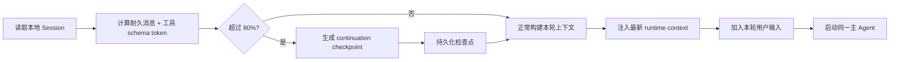
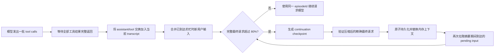
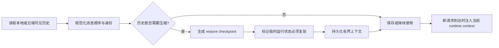

# XiaoBa 主 Agent Continuation Checkpoint 压缩链路

## 目标

本链路解决两类问题：

1. 单个长任务在同一个 episode 内持续调用工具，接近上下文上限后仍能继续执行。
2. 已有会话、云端历史或中断后的会话重新载入时，模型能区分“已经确认的事实”和“必须重新验证的运行状态”。

实现采用 Codex 风格的 continuation checkpoint 模式，但不声称复制任何未公开内部实现。核心原则是：

```text
保留原始记录
→ 在稳定边界生成可续跑检查点
→ 持久化检查点
→ 重新注入当前运行环境
→ 继续同一任务
```

旧 `ContextWindowManager` 和 `ContextCompressor` 暂时只保留给 Branch Agent、Subagent 和独立兼容代码。主 Agent 的 `pre_turn`、`mid_turn`、`restore` 不再保留机械裁剪兜底：只能生成并持久化 continuation checkpoint，失败时保留原文并显式停止。

## 兼容开关

```text
XIAOBA_CHECKPOINT_COMPACTION_ENABLED
```

- 未设置或不为 `false`：旧独立调用方可使用新检查点链路。
- 设置为 `false`：只影响尚未迁移的非主 Agent 兼容调用方。

该开关不能关闭主 Agent 任一阶段的 checkpoint coordinator，也不能恢复请求副本硬截断。上游明确返回 context-length error 时，即使开关为 `false`，ReAct loop 仍必须走持久 checkpoint。

Branch Agent 和 Subagent 暂不接入新 coordinator，行为保持不变。

## 数据分层

### 耐久上下文

会进入检查点并可保存到 Session：

- 主 system prompt；
- 用户消息；
- assistant 消息；
- 工具调用和完整工具结果；
- 之前生成的 continuation checkpoint；
- episode 标识和远端上下文水位。

### 临时运行上下文

不会写进摘要事实，检查点后按当前状态重新生成：

- `[transient_runtime_context]`；
- 当前设备、target route 和本地文件授权；
- runtime feedback；
- synthetic observation；
- 本轮 runner hint。

这可以避免旧设备状态、旧路径授权或已断开的 route 被摘要固化成长期事实。

## 三个触发阶段

### 1. `pre_turn`

发生位置：主 Agent 开始处理一条新的外部用户消息之前。



作用：

- 压缩已经落盘的旧历史；
- 当前新用户输入不会被摘要吞掉；
- 新输入始终位于检查点和最近历史之后。

### 2. `mid_turn`

发生位置：同一个 episode 中，一批工具调用全部返回之后、下一次模型请求之前。



稳定边界要求：

- 不在工具执行中途压缩；
- 不把尚未返回的工具调用写成成功；
- 检查点完成并保存后才继续下一次模型请求；
- 工具批次完成后，已到达的 pending input 会先加入 transcript，再由下一次精确预检决定是否连同 root 一起 checkpoint；
- 摘要生成期间新到达的 correction 会在 resumed inference 前再次拉取，随后重建并重新预算，仍属于当前 episode。

### 3. `restore`

发生位置：

- 本地 Session 恢复后；
- 群聊历史补入后；
- CatsCompany 云端可见历史首次恢复并准备落盘时。



Restore checkpoint 会明确把以下内容标为 `unknown until reverified`：

- 进程是否仍在运行；
- 端口是否仍在监听；
- 文件是否仍存在；
- 设备和 WebSocket 是否在线；
- 凭证、网络和工具执行状态是否仍有效；
- 中断前未完成的工具调用是否成功。

## 阈值

### 主 Agent

```text
最终 provider 请求估算 token（耐久消息 + transient/runtime 注入）
+ 当前完整工具 schema token
> prompt budget × 80%
```

才会触发检查点。

预检发生在所有 identity、群聊参与者、设备授权、runtime feedback、runner hint、环境信息和 recovery hint 都完成注入之后。checkpoint 成功后用相同 episode 状态重新构建整份请求，再次测量；不会在测量后裁剪请求副本。

如果本地估算仍低于阈值、但 provider 明确返回 `413`、`context_length_exceeded`、`maximum context length` 等证据，Runner 会强制生成一次完整 checkpoint，持久化并在同一 episode 内重试一次。第二次仍超限时显式失败，不循环压缩或截断。`premature close`、socket 断开和普通传输错误不属于 context overflow。

### 云端历史恢复

云端历史超过直接落盘预算后进入准备流程。新 coordinator 使用：

```text
target = min(90K, 当前 provider prompt budget)
force = true
```

现有云端恢复入口在历史超过约 60K（或 provider prompt budget 更小时）调用该流程。候选若仍超过 target、摘要失败、超时或取消，则不创建本地 Session，保留云端来源供下次完整重试；不会裁剪最近历史后冒充恢复成功。

## 检查点内容

摘要 prompt 要求保留：

- 用户原始目标和最新补充要求；
- 用户明确禁止事项和约束；
- 已完成、正在做、待做步骤；
- 已确认的决定和失败方案；
- 精确路径、端口、URL、ID、commit、PR、文件和命令；
- 每项关键工具结果和最近稳定工具边界；
- 当前错误、阻塞及下一步；
- 必须重新验证的临时状态；
- artifact/source reference。

禁止：

- 输出模型思维链；
- 猜测缺失事实；
- 把未完成工具调用写成成功；
- 静默丢弃用户约束；
- 将旧 runtime context 当成当前事实。

## 压缩后的消息顺序

```text
稳定 system prompt
→ stable transient rules / skills
→ 当前 episode 的 root（`mid_turn` 且能保留时）
→ checkpoint boundary
→ continuation summary
→ 最近保留的后续 user/assistant 消息
→ 新生成的 transient runtime context
→ 当前或后续用户输入
```

`mid_turn` checkpoint boundary 使用 assistant role；在已有 user 之后插入新的 system message
会让部分 provider 放弃此前稳定前缀。`pre_turn` / `restore` 没有保留在边界前的 root，
因此使用 leading system boundary，避免 assistant-first transcript。这样 `mid_turn` 的稳定
system、skills 和原始 root 能保持在边界之前，旧历史由 summary 承接。

每条 retained pending correction 前会重新生成一条紧邻的 user-level transient boundary；
不会把 system message 插进既有对话，也不会留下没有对应 correction 的孤立 boundary。

`mid_turn` 永远优先保留当前 episode 的首条 root 用户请求，再按预算尽量保留同一 episode 后续到达的用户补充。短消息“继续”不能挤掉 root。

保留预算随上下文增长：默认取上下文预算的 15%，最少 8K、最多 32K token。单条输入超过预算时不会无声消失，而会保留带原文长度、SHA-256、头尾内容和重新读取提示的证据胶囊。

`pre_turn` / `restore` 保留最近普通 user/assistant 原文，最多 8 条，使用同一动态 token 预算。

## 超大工具结果

检查点不能因为一个超大工具结果而无法生成。

处理方式：

1. 原始 `Message` 不修改。
2. 将每条 source message 的 role、tool name、tool call id、episode 元数据和完整文本序列化。
3. 如果一次摘要请求装不下，则按 token budget 对序列化文本做无遗漏切块；所有 chunk 都必须成功，再递归归并 partial summaries。
4. chunk 摘要采用固定小并发；任一 chunk 失败后停止调度新 chunk，整个 checkpoint fail-closed。
5. 图片二进制不重复嵌入摘要 prompt，但由运行时确定性生成
   `[checkpoint_artifact_manifest]`：保留 media type、encoded size、SHA-256、可用的
   file path / attachment ref，以及恢复后必须重新视觉检查的要求。manifest 同时写入
   `__checkpointArtifacts`，不依赖摘要模型自觉复述，并随下一次 checkpoint 和 Session
   重启继续代谢。
6. 任一层失败、超限或不收敛时，原始 transcript 保持不变且正常 provider 不会被调用。

工具结果不会在正常 provider 请求前被重写、head/tail 代理或静默删除。层级摘要的每个 source chunk 合起来覆盖完整序列化来源。

## 重复压缩

旧 checkpoint 不会被永久原样堆叠。

下一次触发时：

```text
旧 checkpoint summary
+ 新增消息
→ 生成一份新的 checkpoint summary
```

旧 boundary 被移除，旧 summary 作为证据重新摘要。远端上下文水位继续带入新 checkpoint，避免恢复后重复拉取。

## 断线、进程重启与恢复

短暂 WebSocket 重连本身不触发压缩。

如果进程或 Session 被重新建立：

1. 加载最近一次已持久化的 checkpoint；
2. 按 `restore` 语义处理过大的恢复历史；
3. 不假定中断前进程、端口、网络和工具状态仍有效；
4. 在新请求开始时重新注入当前 runtime context；
5. 从 checkpoint 的稳定边界继续，必要时重新执行验证工具。

`mid_turn` 检查点在继续模型调用前持久化，因此即使随后断开，恢复时也不会只剩最早的 user input 和最后一条可见回复。

## 失败与兜底

### 摘要模型失败

```text
checkpoint 失败
→ 不替换原 transcript
→ 不推进检查点状态
→ 不调用正常 provider
→ 原始 transcript 原样保留并显式结束本轮
```

### 检查点持久化失败

```text
checkpoint 已生成但落盘失败
→ 不替换当前内存 transcript
→ 不继续使用这份未持久化 checkpoint
→ 保留原 transcript
→ 不调用正常 provider 并显式结束本轮
```

中途压缩必须先成功写入 Session，才会替换内存上下文并继续下一次模型请求。

### 云端恢复摘要失败

云端历史导入 fail-closed：不写入截断 fallback、不创建空白 Session，也不推进恢复成功状态。下一次请求会从云端 authoritative source 重新拉取完整历史。

### 回滚

设置：

```text
XIAOBA_CHECKPOINT_COMPACTION_ENABLED=false
```

不会恢复主 Agent 任一阶段的旧语义压缩、ReAct 请求硬裁剪或静默工具禁用；只保留给尚未迁移的非主兼容调用方。

## 与旧裁剪的关系

新链路启用时：

- 当前 episode 和历史 episode 的工具结果都不再提前折叠；
- `read_file`、`execute_shell`、adaptive folding 和 current-run folding 的旧环境变量不再影响运行；
- 超大工具结果通过完整覆盖的层级分块进入 checkpoint，不再转换为 head/tail 证据代理；
- provider 请求前保留完整预算 guard，但它只触发 checkpoint 或显式失败；
- 不再存在 request-only hard trim、minimal fallback 或 provider-error trim retry；
- 工具 schema 必须完整发送；工具本身无法装入窗口时显式报告能力无法保留，而不是本轮禁用工具；
- Runner 内旧 AI compressor 不重新启用。

这不是两套摘要串联，而是：

```text
新 checkpoint = 主语义压缩
完整请求预算 guard = checkpoint 或 fail-closed
旧 AI compressor = 尚未迁移的 Branch/Subagent 兼容路线
```

## 真实小窗口 canary

`npm run benchmark:checkpoint-canary` 把本地 prompt budget 压到 8K，并用真实 provider、
完整工具定义和超大工具结果强制同一 ReAct episode 触发 checkpoint。每次运行使用新的
cache-isolation nonce；同一运行的 checkpoint 前后必须保持相同 stable-prefix 与 toolset
fingerprint。验收同时要求：

- 恰好一次工具执行、两次主推理，所有物理请求都有完整 started→terminal 生命周期；
- checkpoint 先持久化再恢复主推理，episode 不变且工具集不变；
- head / middle / tail 三处事实都能在最终答案中恢复；
- provider usage/source 全部可观测，恢复主推理的 cache-read 至少达到稳定前缀估算的
  75%，且绝对值不低于 1024 tokens；
- 控制台和 Prompt Trace 不记录 canary oracle，错误输出只暴露 allowlist 字段。

该 canary 验证 no-truncation continuation 的真实行为与一次缓存复用，不替代正式的
多任务、连续三轮、token-weighted 94% acceptance benchmark。

## 256K 场景验收

`tests/checkpoint-compaction-256k-scenario.test.ts` 使用正式 token 预算算法和
`CheckpointCompactionCoordinator`，对 `pre_turn`、`mid_turn`、`restore`
三条链路进行可重复的 256K 场景验收。

采用 Relay 常用的 `32,768` 最大输出配置时：

```text
模型上下文窗口：256,000
安全保留：52,224
Prompt 预算：203,776
压缩触发线：超过 163,020（Prompt 预算的 80%）
```

本次确定性测试使用约 4K token 的检查点，并模拟 8K tool schema：

| 场景 | 压缩前 durable + tools | 压缩后 messages + tools | 压缩后占 Prompt 预算 |
| --- | ---: | ---: | ---: |
| 新回合前历史压缩 | 164,039 | 24,152 | 11.9% |
| 同一 episode 工具后续跑 | 169,069 | 23,166 | 11.4% |
| 云端/中断历史恢复 | 168,033 | 28,636 | 14.1% |

这些数字是固定输入下的验收结果，不是生产环境必须达到的硬比例。实际压缩后大小取决于：

- bundled system prompt；
- 当前工具 schema；
- 检查点模型输出长度；
- 8K–32K token 的动态近期原文保留；
- 当前 runtime context。

当前实现保证 `80%` 触发，但不强行把结果裁到某个固定百分比，避免为了追求数字再次丢失任务事实。真实模型长任务测试仍用于验证检查点内容质量。

## 真实运行审计

普通运行日志会记录：

- `phase`；
- 压缩前后 token 和消息数；
- checkpoint summary 字符数与 SHA-256；
- 保留的 root、pending 和超长输入证据数量。

普通日志不重复写入完整 checkpoint 正文，避免泄露和日志膨胀。完整语义质量从两处检查：

1. 当前 Session JSONL 中 `__checkpointSummary: true` 的持久消息；
2. 开启 Prompt Trace 后，检查下一次真实模型请求收到的 checkpoint、近期原文和新 runtime context。

测试机可使用：

```powershell
$env:XIAOBA_PROMPT_TRACE="1"
$env:XIAOBA_PROMPT_TRACE_CONTENT="1"
$env:XIAOBA_PROMPT_TRACE_MESSAGE_CHARS="24000"
```

真实验收至少覆盖：

1. 预先写入精确端口、路径、ID 和禁止事项；
2. 运行足够长的工具任务触发 `mid_turn`；
3. 触发后继续执行并询问精确事实；
4. 重启进程后发送“继续”，确认从已持久 checkpoint 恢复；
5. 对照 Session JSONL、Prompt Trace 和最终行为，而不只看是否出现“压缩成功”日志。

## 后续删除旧代码的条件

旧链路只有在以下条件都满足后才能删除：

1. 主 Agent 定向测试和完整测试持续通过；
2. 本地长 episode 真实测试能在检查点后继续调用工具；
3. 忙时输入不会被拆成错误的新 episode；
4. 中断/重启能从持久 checkpoint 恢复；
5. 云端大历史恢复正常；
6. 检查点生成或持久化失败时原 transcript 完整保留且 provider 不被调用；
7. 主 Agent 无旧压缩回退开关依赖；
8. 观察日志确认不存在重复 checkpoint、频繁压缩或 runtime 状态污染。

满足后可单独提交清理 PR，删除：

- 对应旧摘要 prompt 和只服务旧链路的测试。

完整请求预算 guard、工具结果 artifact 和 Session 原始日志不应随之删除；预算 guard 必须继续保持“checkpoint 或显式失败”的语义。
