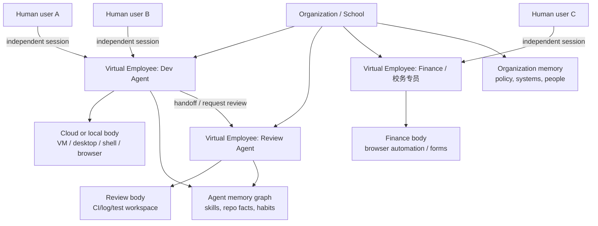
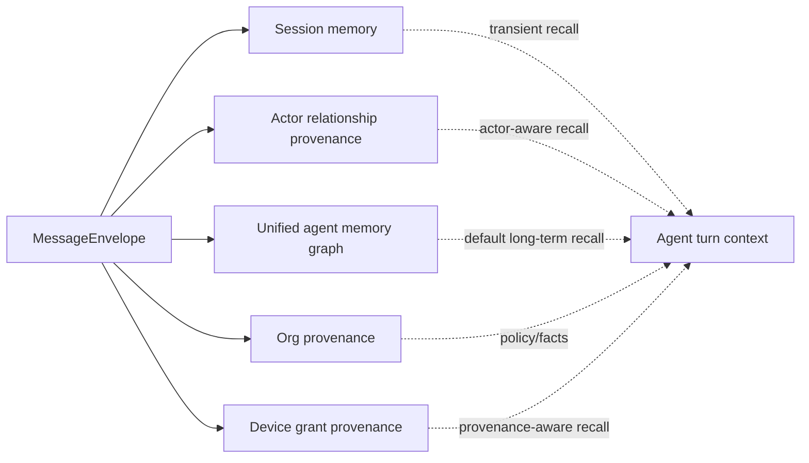
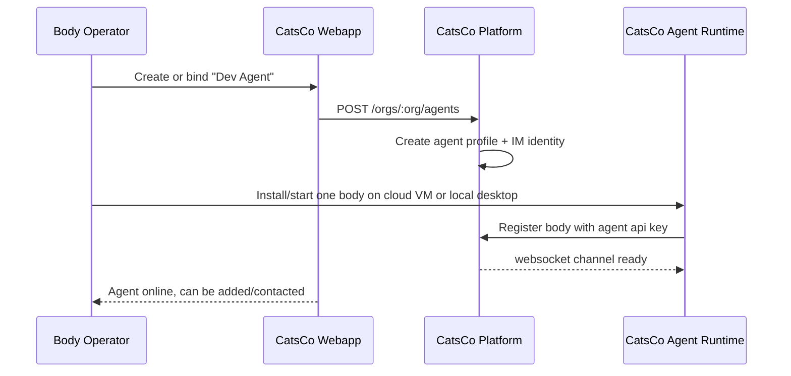
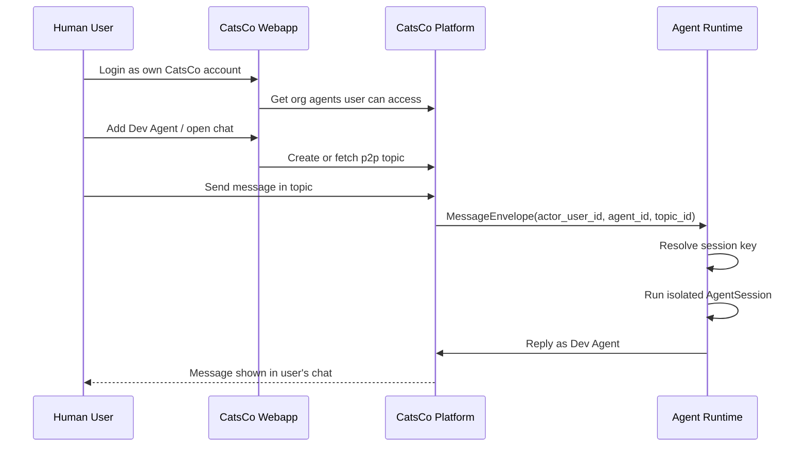
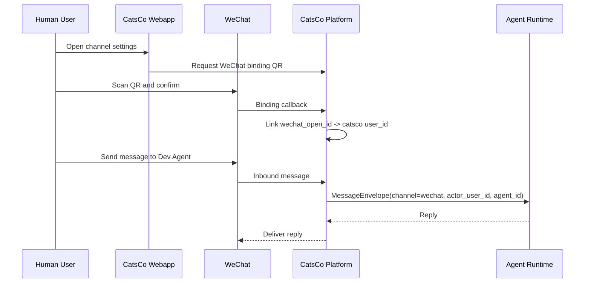
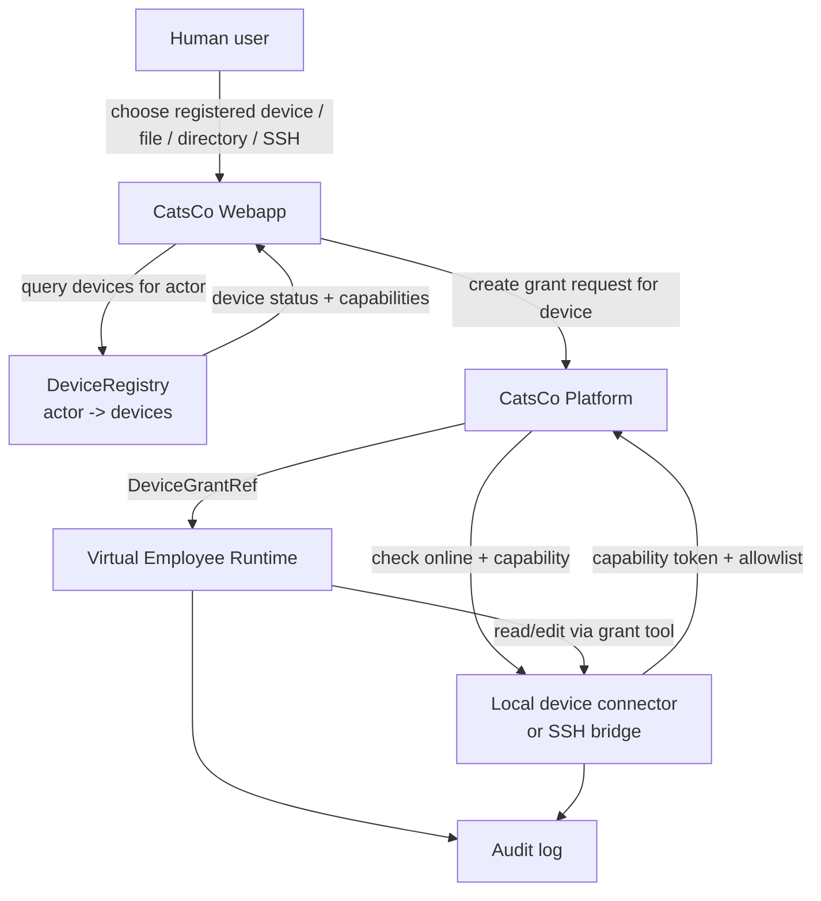
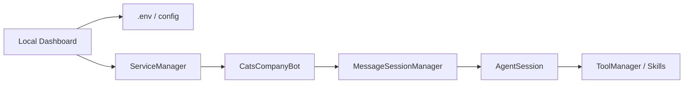
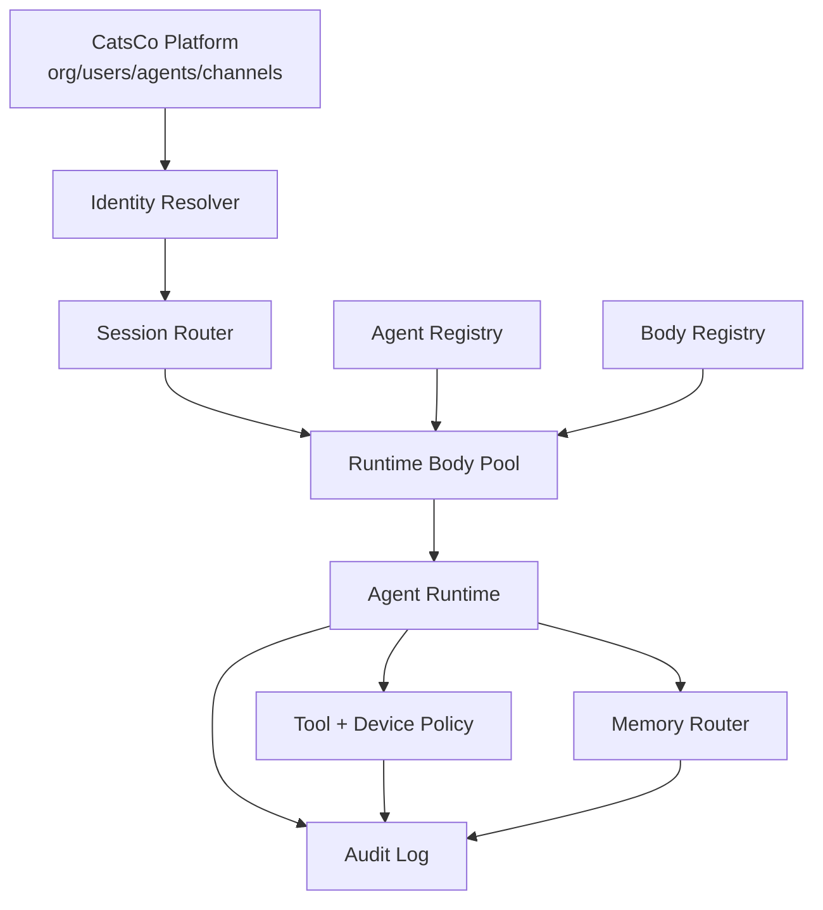

# CatsCo Virtual Employee Architecture Transition

> Status: living transition plan; CLI beta baseline and first platform body lease slice are implemented
> Scope: XiaoBa-CLI / CatsCo Agent local runtime, CatsCo Web/IM platform, WeChat binding, device access, memory, and multi-agent management.

## 1. Core Reframe

CatsCo Agent should be modeled as a virtual employee first, and a personal assistant only as the single-user special case.

The important boundary is not local vs cloud. The important boundary is ownership:

- A personal assistant belongs primarily to one human user.
- A cloud bot belongs primarily to a task trigger or deployment.
- A virtual employee belongs to an organization, has its own identity, body, tools, memory, credentials, skills, work habits, and can cooperate with many humans through isolated sessions.

For a single user, the UX can still feel like a personal expert. The user opens CatsCo, chooses an expert, and chats naturally. The architectural truth is different: that expert is an organization-owned agent with a stable profile and shared institutional memory.

## 2. Current Code Reality

The current repository already has useful foundations, and this branch has moved the first safety baseline forward. The remaining product shape is still closer to a local single-agent runtime than a full organization virtual-employee system.

### 2.1 What Already Works

| Area | Current implementation | Why it helps |
| --- | --- | --- |
| Multi-session runtime | `MessageSessionManager` creates one `AgentSession` per `sessionKey`. | The core engine can already isolate sessions and avoid blocking unrelated conversations. |
| CatsCo Web connector | `CatsCompanyBot` connects with a bot API key and handles p2p/group topics. | This is close to the "agent as IM account" body. |
| Dashboard CatsCo chat | `/api/cats/*` routes login a CatsCo user, create/bind a bot, and send messages through CatsCo Web APIs. | Good prototype for local setup and operator chat. |
| Local file grants | `local-file-grants.ts` issues one-time file tokens before upload. | Good primitive for explicit local-device authorization. |
| Runtime profile | `runtime-profile*.ts` describes model/tools/skills/working directory. | Good base for per-virtual-employee profiles. |
| GauzMem integration | `TurnContextBuilder` retrieves memory by session and logs turn metadata. | Good base for long-term memory, but scopes need to change. |
| Agent-to-agent bridge | `bridge/*` and sub-agent tools exist. | Good seed for later agent handoff, though not organization-aware yet. |

### 2.2 Main Mismatch

At the product level, CatsCo still mostly behaves like:

```text
one local desktop/runtime
  owns one current CatsCo user login
  owns one current bot api key
  starts one CatsCompany connector process
  uses env/config as local singleton state
  keeps cc_user:<senderId> / cc_group:<topic> as physical session keys
```

The important config split has now been narrowed but not removed:

- `.xiaoba/catsco.json` is now the local authority for CatsCo account login, current bot binding, body/device/install ids, endpoints, and small CatsCo preferences.
- `.env` is still written as a legacy mirror for connector startup and still carries model, Feishu, Weixin, and other old connector settings.
- Legacy `/api/cats/setup` still exists for compatibility, but the normal dashboard path is explicit login -> create/select bot -> bind current body -> start connector.

So the current rule is: CatsCo identity and body binding live in typed local config; old secrets stay in `.env` until the model-source and channel-binding work exists.

Target CatsCo should behave like:

```text
one organization
  owns many virtual employees
  each employee has one or more runtime bodies
  each employee has stable credentials, profile, skills, memory scopes
  many humans can add/contact each employee
  each message carries actor identity, channel identity, session identity, permissions
  local or personal devices are only accessed through explicit grants
```

### 2.3 Concrete Gaps

| Gap | Current behavior | Target behavior |
| --- | --- | --- |
| Agent identity | Bot binding is in `.xiaoba/catsco.json` and mirrored to `.env`; platform now has first in-memory active body lease. | First-class `agent_id`, org ownership, display profile, role, body, credentials, tools, memory. |
| Human identity | CatsCo incoming messages now carry a local identity snapshot, but platform actor/org/permission metadata is still thin. | Every message should carry `actor_user_id`, org membership, role, permissions, channel binding. |
| Session key | CatsCo private sessions still physically use `cc_user:<senderId>`, group sessions use `cc_group:<topic>`; identity is sidecar metadata. | Session keys should eventually include org, agent, actor, channel, topic/thread, and session purpose. |
| Dashboard | Local dashboard is both operator console and chat client for one logged-in account. | Split into agent-body console and CatsCo account webapp UX. |
| WeChat | Weixin connector is a direct bot token with `user:<from>` sessions. | WeChat should be a per-human channel binding into CatsCo identity, then routed to the selected agent/session. |
| Device access | File grants are local, one-time, and only for local dashboard upload. | Device grants should become explicit capabilities: upload, local device connector, SSH connector, directory/tool grants. |
| Memory | GauzMem is keyed by raw session id/type. | Memory should remain one agent world model, but every evidence/retrieval path needs actor, channel, session, org, and grant provenance. Default recall is actor/session-aware; cross-actor recall is allowed only when metadata and relevance justify it. |
| Multi-agent | Bridge/subagents exist, but not as managed organization employees. | Roster, awareness, handoff policies, audit trail, agent-to-agent tasks. |
| Service management | `ServiceManager` registers one `catscompany`, one `feishu`, one `weixin`. | Runtime bodies should be instance-based: `agent:<agent_id>:connector:<channel>`. |

### 2.4 Shared State That Blocks Multi-agent Bodies

Several modules are safe enough for one local assistant, but become risky when one process or one cloud host runs multiple virtual employees.

| Module | Current shared state | Risk in target model | Direction |
| --- | --- | --- | --- |
| `Metrics` | Static singleton arrays and `reset()` per turn. | Concurrent sessions can erase or mix each other's token/tool metrics. | Make metrics run-scoped and pass through `ToolExecutionContext` or `AgentTurnController`. |
| `ConfigManager` / `.env` | Process-wide model/channel credentials. | One body cannot safely host different agents with different credentials or model policies. | Resolve config from `agent_id` / `body_id` snapshot, with `.env` only as bootstrap fallback. |
| `process.env.CURRENT_AGENT_DISPLAY_NAME` | Mutated when CatsCo connector receives bot name. | Multiple agents in one process would race over prompt identity. | Runtime profile should carry identity, no mutable process env. |
| `ServiceManager` | Fixed service names: `catscompany`, `feishu`, `weixin`. | Cannot represent `dev-agent` and `review-agent` connectors independently. | Register service instances keyed by `body_id` + `agent_id` + channel. |
| `SessionStore` | Filename derived from raw `sessionKey`, under `data/sessions`. | No metadata index for org/agent/user; migration and filtering become fragile. | Store sidecar metadata or move to indexed session records. |
| `GauzMemClient` | Hard-coded `agent: "xiaoba"` and raw `sessionId`. | Memory graph can remember across people, but cannot reliably know when a remembered fact is relevant to the current actor. | Pass actor/org/agent/session/grant provenance and retrieval policy into every retrieve/event call. |
| `SubAgentManager` | Singleton keyed by parent session key. | Mostly workable, but only if session keys become globally unique. | Move to session-id keyed records and add agent/org metadata to events. |

This is why the first refactor should be identity/session contracts rather than UI. Without unique identity in the runtime, UI changes will keep producing special cases.

### 2.5 CatsCompany Platform Reality After First Lease Slice

I reviewed CatsCompany `main` after fast-forwarding it to `84c7c72` (`补齐中转站自动登录部署配置`) and then added the first bot-body lease slice on branch `codex/bot-body-lease`. The platform is already useful as an IM/user/bot system; it now has a beta safety guard for "one bot, one active body", but it is not yet a complete virtual-employee body system.

Key observations:

- A bot is currently a `users` row with `account_type = 'bot'` plus a `bot_config` row. The bot API key maps directly to the bot UID.
- Bot WebSocket auth now requires `X-CatsCo-Body-ID` when using a bot API key. The first active body gets the lease; a different body for the same bot is rejected; the same body can reconnect and replace its old connection.
- Human accounts can still have multiple WebSocket clients. The lease only changes bot runtime behavior.
- `/api/bots` can create/list/manage bots for an owner, and `/api/bots/api-key` can return the bot API key. There is still no persisted `AgentBody` table, scoped body token, or distributed lease; the current visible body status is a beta view over the in-memory lease.
- Message wire payload supports `metadata`, Webapp renders it for working/tool messages, and platform message storage now persists/returns general `metadata`. This is enough for beta identity/provenance continuity, but not a replacement for first-class TopicContext and permission records.
- The new account-center/relay work is useful precedent for service tokens and user identity introspection, but it is not a channel-binding or agent-body system yet.

This changes the implementation priority: the first duplicate-body safety problem has a beta answer. The next platform problem is making that body state visible/queryable, then letting organization users naturally find and talk to the same virtual employee.

Minimum platform-side contract:

```text
bot uid / virtual employee id
  -> current beta: one active in-memory body lease for WebSocket runtime connections
  -> next: visible/persisted AgentBody state
  -> later: scoped body token or lease generation
  -> later: websocket + REST runtime calls accepted only from the active body
```

Human accounts can keep multiple WebSocket clients. Bot runtime accounts now reject a duplicate different body in the first lease implementation; future work should expose that state to users and make it distributed if CatsCompany runs multiple server instances.

## 3. Target Product Model

### 3.1 Product Shape



### 3.2 User Experience Principles

The user should not feel forced into a body console. They should feel they are talking to a strong expert.

The normal flow:

1. User logs into CatsCo Webapp with their own account.
2. User sees organization agents they can access, or adds an agent as a friend.
3. User opens a chat with the agent.
4. User can optionally bind WeChat to that CatsCo account and continue the same relationship from WeChat.
5. User uploads a file, selects one of their registered devices, or grants device access when needed.
6. Agent sees who the user is, what permissions they have, which devices belong to that actor, and what device/file grants are active.
7. Agent handles the task in an isolated session, without blocking other users talking to the same agent.

Important: this preserves the "personal assistant" feeling while making the agent an organization-owned virtual employee.

## 4. Target Data Model

The model below is the minimum shape needed to stop mixing local user state, agent identity, agent body state, transport identities, sessions, device grants, and provenance. GauzMem can consume the same provenance later, but the first implementation step is session/turn provenance.

This is not meant to introduce a privileged chat role. The person operating the local/cloud dashboard is a body operator only while using that console. When that same person talks through CatsCo, WeChat, or Feishu, they are just a normal `HumanUser` / actor with a permission snapshot.

The important split is:

- `HumanUser`: the CatsCo actor speaking.
- `VirtualEmployee`: the organizational virtual employee being contacted.
- `AgentBody`: the one process/device/VM where this virtual employee is currently running.
- `ChannelBinding`: a WeChat openid, Feishu user id, or other external identity bound back to a CatsCo actor.
- `UserDevice`: a human actor's registered computer, SSH host, cloud drive, or local connector that can be checked for online status and capabilities.
- `ConversationSession`: the isolated conversation between one actor/topic and one virtual employee.
- `SessionProvenance`: per-turn source metadata that says which actor, agent, body, channel, topic, and message produced this session event.
- `DeviceGrant`: explicit temporary access by one agent to one user-owned device, file, directory, SSH host, or desktop automation scope.
- `MemoryScope`: later GauzMem retrieval policy built on top of session/turn provenance. It should not split the agent into per-user memories.

### 4.1 Identity Objects

```ts
interface Organization {
  orgId: string;
  name: string;
  type: "company" | "school" | "team";
}

interface HumanUser {
  userId: string;
  orgId: string;
  displayName: string;
  roles: string[];
  permissions: string[];
  catscoActorId: string;
}

interface VirtualEmployee {
  agentId: string;
  orgId: string;
  handle: string;
  displayName: string;
  role: string;
  status: "draft" | "active" | "paused" | "retired";
  profileId: string;
  primaryBodyId: string;
  memoryPolicyId: string;
}

interface AgentBody {
  bodyId: string;
  installationId: string;
  agentId: string;
  kind: "local-desktop" | "cloud-vm" | "container" | "external-runtime";
  runtimeProfileId: string;
  serviceEndpoint?: string;
  workingDirectory?: string;
  status: "offline" | "online" | "degraded";
}

interface CredentialBinding {
  credentialId: string;
  orgId: string;
  agentId?: string;
  bodyId?: string;
  ownerUserId?: string;
  kind: "catsco_user_token" | "agent_api_key" | "body_token" | "model_api_key" | "github_token" | "wechat_bot_token" | "ssh_key" | "browser_profile";
  scope: string[];
  issuedBy: "platform" | "body_operator" | "user" | "local_env";
  rotationPolicy?: string;
  expiresAt?: string;
}

interface RuntimeProfileSnapshot {
  profileSnapshotId: string;
  agentId: string;
  bodyId: string;
  surface: "catsco" | "wechat" | "feishu" | "api" | "cli";
  workingDirectory: string;
  model: Record<string, unknown>;
  tools: { enabled: string[] };
  skills: { enabled: boolean; policy?: string };
  logging: { sessionEvents: boolean; uploadEnabled?: boolean };
  createdAt: string;
}
```

### 4.2 Channel Objects

```ts
interface ChannelIdentity {
  channelIdentityId: string;
  orgId: string;
  userId?: string;
  agentId?: string;
  channel: "catsco" | "wechat" | "feishu" | "api";
  externalUserId: string;
  displayName?: string;
}

interface AgentContact {
  contactId: string;
  orgId: string;
  agentId: string;
  userId: string;
  state: "requested" | "accepted" | "blocked";
  createdAt: string;
}

interface ChannelBinding {
  bindingId: string;
  orgId: string;
  userId: string;
  channel: "wechat" | "feishu" | "api";
  externalUserId: string;
  verifiedAt: string;
  defaultAgentId?: string;
}
```

### 4.3 Conversation Objects

```ts
interface ConversationSession {
  sessionId: string;
  orgId: string;
  agentId: string;
  actorUserId?: string;
  participantUserIds?: string[];
  channel: "catsco" | "wechat" | "feishu" | "api";
  topicId: string;
  sessionKind: "p2p" | "group" | "task" | "handoff";
  state: "active" | "idle" | "archived";
  createdAt: string;
  lastActiveAt: string;
}

interface MessageEnvelope {
  envelopeId: string;
  orgId: string;
  agentId: string;
  bodyId?: string;
  sessionId: string;
  actorUserId: string;
  actorDisplayName?: string;
  actorChannelIdentityId: string;
  channel: "catsco" | "wechat" | "feishu" | "api";
  channelBindingId?: string;
  externalChannelUserId?: string;
  topicId: string;
  externalMessageId?: string;
  channelSeq?: number;
  replayCursor?: string;
  text: string;
  attachments: AttachmentRef[];
  permissionsSnapshot: string[];
  receivedAt: string;
  metadata?: Record<string, unknown>;
}

interface SessionRuntimeState {
  sessionId: string;
  currentDirectory?: string;
  busy?: boolean;
  pendingRestore?: boolean;
  pendingAttachments?: AttachmentRef[];
  pendingAnswer?: { expectedActorUserId: string; expiresAt: string };
  subAgentCallbackRefs?: string[];
  updatedAt: string;
}

interface OutboundMessageEnvelope {
  envelopeId: string;
  orgId: string;
  agentId: string;
  sessionId: string;
  targetTopicId: string;
  channel: "catsco" | "wechat" | "feishu" | "api";
  kind: "text" | "file" | "runtime_plan" | "tool_progress" | "tool_result";
  content: unknown;
  triggeredByTurnId?: string;
  sendStatus: "pending" | "sent" | "failed";
  error?: string;
  createdAt: string;
  sentAt?: string;
}

interface AttachmentRef {
  attachmentId: string;
  kind: "file" | "image" | "device_grant";
  name: string;
  url?: string;
  size?: number;
  grantId?: string;
  provenance: "uploaded" | "local_grant" | "remote_device" | "platform";
}

interface LocalCacheRef {
  cacheId: string;
  attachmentId: string;
  localPath: string;
  sourceUrl?: string;
  retentionPolicy: "turn" | "session" | "ttl" | "manual";
  expiresAt?: string;
  scanned: boolean;
}
```

For group sessions, `ConversationSession.actorUserId` should not be required. The session belongs to the group/topic, while every inbound `MessageEnvelope` still carries the actual actor for that message. This keeps group history shared without losing per-human identity.

### 4.4 Device Access Objects

```ts
interface UserDevice {
  deviceId: string;
  ownerUserId: string;
  orgId: string;
  label: string;
  kind: "desktop-agent" | "ssh-host" | "cloud-drive" | "uploaded-file";
  status: "online" | "offline" | "unknown" | "revoked";
  capabilities: Array<"file_read" | "file_write" | "shell" | "ssh" | "desktop_automation" | "browser_profile">;
  lastSeenAt?: string;
  connectorVersion?: string;
}

interface DeviceGrant {
  grantId: string;
  orgId: string;
  agentId: string;
  userId: string;
  deviceId: string;
  scope: "file" | "directory" | "ssh" | "desktop-automation" | "browser-profile";
  pathAllowlist?: string[];
  capabilities: string[];
  expiresAt: string;
  oneTime: boolean;
  auditRequired: boolean;
}
```

Important: `ChannelBinding` and `UserDevice` are different objects. WeChat or Feishu tells the platform which CatsCo actor is speaking. The actor's device list tells the agent which computers or connectors that actor can authorize. A request like "go to my computer and get `xxx`" must resolve through `actor -> UserDevice[] -> DeviceGrant`, not through the agent body's local filesystem.

Useful product metaphor: a registered `UserDevice` is a "personal cloud drive" relative to the agent body. The cloud VM remains the virtual employee's runtime, tools, model execution, memory, and optimized working environment. The user's laptop does not run the agent and should not shape the agent's runtime; it only exposes storage/capabilities through a lightweight connector after the user approves a grant. This is much easier to stabilize than running the full agent on every user's machine, because the local connector can stay narrow: identity, heartbeat, file listing/read/write within approved scopes, upload/download streaming, and revocation.

This should not be implemented as a hardcoded natural-language workflow such as "if the user says my computer, always call these three APIs." The better contract is:

- Prompt: tell the agent that its body filesystem, uploaded attachments, and a user's registered devices are different sources.
- Tool descriptions: expose device-aware tools such as `list_user_devices`, `request_device_grant`, and grant-scoped file/SSH tools.
- Platform/tool layer: enforce actor, device, grant, expiry, and capability boundaries.
- Agent reasoning: decide when the user's request requires device lookup or grant request.

### 4.5 Memory Scopes

Memory must be attributed, but not split into unrelated per-user brains. The agent should keep one growing world model and use provenance to decide what is relevant in a specific turn. Default retrieval should bias toward the current actor/session plus agent/org knowledge; cross-actor evidence can still surface when metadata and relevance make it appropriate.

```text
memory_provenance:
  agent:<agent_id>                  agent's own world model and work habits
  org:<org_id>                      organization facts and policy
  actor:<org_id>:<user_id>          facts about a relationship with one actor
  session:<session_id>              active task context
  device_grant:<grant_id>           facts observed through a specific grant
```



## 5. User Journeys

### 5.1 Body Operator Creates Or Binds A Virtual Employee



Body operator choices:

- Name and role: "Dev Agent", "Review Agent", "AI 校务专员".
- Body: local desktop, cloud VM, container. The initial rule is one virtual employee per process/profile.
- Runtime profile: model, tools, skills, working directory, file/device policy.
- Credentials: GitHub token, browser profile, finance system login, school system login.
- Memory policy: which scopes are enabled and who can inspect/audit them.

### 5.2 Human Adds And Chats With Agent



From user perspective this is just a chat. From runtime perspective this is not just `senderId`; it is an authenticated actor with permissions and org context.

### 5.3 WeChat Binding

Current dashboard QR code retrieves a bot token. Target flow should bind WeChat identity to the logged-in CatsCo account.



This makes WeChat another channel for the same user-agent relationship, not a separate identity universe.

Compatibility detail: the current WeChat connector also persists `get_updates_buf` and per-user `context_token` under `data/weixin`. A platform-mediated WeChat channel must either own those cursors/tokens itself or let the legacy local connector continue owning them while it reports identity bindings to CatsCo. Otherwise the migration can preserve identity but lose reply continuity.

### 5.4 Personal Device Access

When a task needs files on a user's computer, the agent should not automatically own that computer. The user grants a capability.

Think of this as making the user's computer a mounted personal cloud drive for the agent body. The agent still thinks, plans, executes heavy tools, writes reports, and keeps session state inside its own body. The device connector only answers constrained storage/capability requests for the authenticated CatsCo actor.



Grant types:

- Device listing: actor's registered Mac/Windows/Linux/SSH/cloud-drive connectors, with online status and capabilities.
- Lightweight local connector: a small app that keeps a long connection to CatsCo and turns selected local folders/files into grant-scoped remote storage for the cloud body.
- Upload-only: user uploads files into the chat.
- One-time local file: current `local-file-grants.ts` model.
- Directory grant: allow read/write within approved directories.
- SSH grant: agent receives a named tool profile, not raw hidden credentials.
- Desktop automation grant: explicit, time-bound browser/desktop access.

The runtime must distinguish three different file origins:

| Origin | Example today | Access rule |
| --- | --- | --- |
| Body-owned filesystem | The agent's cloud VM workspace or local runtime `workingDirectory`. | Normal file tools can operate within the body policy. |
| Chat attachment cache | CatsCo/WeChat attachments downloaded into `tmp/downloads` or `files/weixin`. | Read as attachment provenance; do not treat as the user's general file library. |
| Human-granted device/path | User-approved local file, directory, SSH host, or desktop automation. | Must go through `DeviceGrant` tools and audit. |

This matters because current incoming CatsCo and WeChat attachments are downloaded automatically by connectors. Those downloads are not the same as a broad device grant.

### 5.5 End-to-end UX Maps

#### Body operator: deploy or inspect a virtual employee body

| Step | User sees | System does |
| --- | --- | --- |
| 1. Open console | Operator opens the local desktop, cloud VM, or container dashboard. | Load the local profile/body config. |
| 2. Confirm current agent | Create or bind the current virtual employee identity. Role templates only initialize profile. | Fetch/create `VirtualEmployee` and candidate `RuntimeProfileSnapshot`. |
| 3. Lock body | Confirm this process/profile is the body for one CatsCo Bot identity. | Create `AgentBody`, issue scoped body/bot credentials, bind profile. |
| 4. Start channels | Turn on CatsCo, WeChat, Feishu, API as needed. | Start connectors for this one agent/body profile. |
| 5. Verify health | See online status, logs, skills, memory, credentials. | Heartbeat body, report readiness, expose audit/log streams. |

#### Organization member: chat with the expert

| Step | User sees | System does |
| --- | --- | --- |
| 1. Login | User logs into CatsCo with personal account. | Resolve `HumanUser`, org roles, permissions. |
| 2. Find agent | User sees available virtual employees or adds one as a friend. | Check `AgentContact` policy and create/fetch p2p topic. |
| 3. Send message | User chats naturally, like with a strong personal expert. | Build `MessageEnvelope` with actor, agent, topic, permissions. |
| 4. Independent work | User can leave; other users can keep chatting with same agent. | `SessionRouter` maps to isolated `AgentSession`; queues only per session. |
| 5. Delivery | User receives text/files/tool progress from the agent. | Emit `OutboundMessageEnvelope` and audit visible actions. |

#### Organization member: bind external channels

| Step | User sees | System does |
| --- | --- | --- |
| 1. Open channel settings | User starts from their CatsCo account and chooses "Bind WeChat" or "Bind Feishu". | Create pending `ChannelBinding`. |
| 2. Scan or authorize | User scans QR or completes provider auth. | Link WeChat openid / Feishu user id to CatsCo `userId`. |
| 3. Choose default agent | User chooses which virtual employee external-channel messages go to by default. | Store default `agentId` or let the channel command choose one. |
| 4. Chat through the channel | User sends message in WeChat/Feishu. | Platform or legacy connector resolves external identity back to CatsCo actor. |

#### Organization member: grant access to local computer

| Step | User sees | System does |
| --- | --- | --- |
| 1. Agent requests access | "I need this file/directory/host to continue." | Resolve current channel identity to CatsCo actor and query that actor's `UserDevice` list. |
| 2. User chooses device | User sees "MacBook Pro", "办公室 Windows", "SSH: school-server" with online/capability state. | Select `deviceId`; if no device exists, guide user to install connector, upload file, or add SSH. |
| 3. User approves scope | User uploads, chooses a directory, or authorizes SSH/local connector scope. | Create `DeviceGrant` with `deviceId`, expiry, capabilities, provenance. |
| 4. Agent operates | Agent reads/edits only within the grant. | Grant-aware tools enforce allowlist and emit audit events. |
| 5. User can revoke | User sees active grants and can revoke them. | Mark grant revoked; tools fail closed. |

### 5.6 What The Agent Sees Per Turn

The agent should receive identity as operational context, not as vague prompt text.

```text
current virtual employee:
  org_id: org_school_001
  agent_id: agent_dev
  body_id: body_cloud_vm_01
  role: development expert

current actor:
  user_id: usr_alice
  display_name: Alice
  channel: catsco
  permissions: repo:read, repo:write, agent:chat

current session:
  session_id: sess_...
  topic_id: p2p_...
  kind: p2p

active grants:
  grant_123: Alice's ~/Documents/report.xlsx, read/write, expires in 30m
```

This is the practical difference between "the model guessed who is talking" and "the runtime knows who is talking".

## 6. Runtime Architecture

### 6.1 Current Runtime



### 6.2 Target Runtime



Key changes:

1. The connector should not construct a session key directly from transport IDs.
2. The connector should normalize inbound messages into `MessageEnvelope`.
3. A `SessionRouter` should resolve the durable `ConversationSession`.
4. `AgentSession` should receive identity context, not only a string key.
5. Tools should receive `actor`, `agent`, `org`, `session`, and active grants in `ToolExecutionContext`.

For multiple virtual employees, service isolation is part of the architecture. Changing `ServiceManager` keys is not enough. Each connector instance also needs isolated command args, environment/profile path, logs, process status, and any channel-specific cursor state. The safer initial path is one virtual employee / agent body per process/profile; shared-process hosting can come later after state has been made run-scoped.

## 7. Proposed Refactor Contracts

This is the smallest set of code-level abstractions that would let the current code evolve without a rewrite.

### 7.1 Message Envelope

New module:

```text
src/identity/message-envelope.ts
```

```ts
interface RuntimeActorContext {
  orgId: string;
  agentId: string;
  bodyId?: string;
  actorUserId: string;
  actorDisplayName?: string;
  channel: "catsco" | "wechat" | "feishu" | "api";
  channelBindingId?: string;
  externalChannelUserId?: string;
  permissions: string[];
}

interface RuntimeMessageEnvelope {
  envelopeId: string;
  externalMessageId?: string;
  channelSeq?: number;
  replayCursor?: string;
  topicId: string;
  sessionId?: string;
  sessionKind: "p2p" | "group" | "task" | "handoff";
  text: string;
  attachments: AttachmentRef[];
  actor: RuntimeActorContext;
  raw: unknown;
}
```

`CatsCompanyBot.parseMessage()` should eventually return this envelope or call a resolver that returns it.

### 7.2 Session Key V2

New module:

```text
src/core/session-key.ts
```

Proposed format:

```text
org:<org_id>:agent:<agent_id>:user:<actor_user_id>:channel:<channel>:topic:<topic_hash>
```

For group chats:

```text
org:<org_id>:agent:<agent_id>:group:<topic_id>:channel:<channel>
```

Compatibility:

- Keep reading old keys like `cc_user:<senderId>`.
- New session store files should include metadata header/sidecar so future migrations do not depend only on filenames.

### 7.3 Runtime Identity Context

Extend `AgentSession` constructor or options:

```ts
interface AgentSessionContext {
  sessionId: string;
  orgId?: string;
  agentId?: string;
  bodyId?: string;
  actorUserId?: string;
  channel?: string;
  topicId?: string;
  permissions?: string[];
  activeGrantIds?: string[];
}
```

Then `AgentTurnController.createRunner()` can pass this into `ToolExecutionContext`. The critical code path is where `AgentTurnController` currently creates `toolExecutionContext` with `sessionId`, `surface`, `permissionProfile`, `workspaceRoot`, `workingDirectory`, and `channel`; that context needs org/agent/body/actor/grant fields too.

Current `MessageSessionManager.getOrCreate(key)` only accepts a string key. The migration should add an overload instead of changing all adapters at once:

```ts
getOrCreate(key: string, options?: { identity?: AgentSessionContext }): AgentSession
```

Initial behavior:

- If `options.identity` is absent, keep current behavior.
- If present, store it on `AgentSession` before initialization.
- `composeSessionSystemPromptProvider` can append actor/agent/channel context.
- `AgentTurnController` can pass the same identity into tools, turn logs, prompt transient context, and outbound audit. GauzMem should remain unchanged until the session layer is stable.

### 7.4 Agent Registry

New module:

```text
src/agents/virtual-employee-registry.ts
```

Responsibilities:

- Load virtual employee profiles.
- Resolve runtime profile by `agent_id`.
- Resolve credentials and channel bindings.
- Provide display name, role, skill policy, memory policy.

Short-term storage:

- Local JSON under `~/.xiaoba/agents.json` or `data/agents/*.json`.
- Continue `.env` fallback for old single-agent installs.

Long-term storage:

- CatsCo Platform owns org/user/agent records.
- Runtime body receives a scoped body token and agent config snapshot.

### 7.5 Channel Binding Resolver

New module:

```text
src/channels/identity-resolver.ts
```

Responsibilities:

- Convert CatsCo sender/topic metadata into `actor_user_id`, `agent_id`, org membership, permissions.
- Convert WeChat open id or Feishu user id into CatsCo user id through `ChannelBinding`.
- Treat CatsCo account/actor as the source of truth; external channel identities are bindings, not parallel user identities.
- Reject or quarantine messages without a valid actor/agent relationship.
- Attach a permission snapshot to the envelope.

### 7.6 Device Grant Tools

Existing local file grant should become one implementation of a broader grant system.

Possible modules:

```text
src/device-grants/grant-store.ts
src/device-grants/local-file-provider.ts
src/device-grants/ssh-provider.ts
src/tools/device-read-tool.ts
src/tools/device-write-tool.ts
src/tools/device-shell-tool.ts
```

Tool behavior:

- No raw local path access unless current body owns that filesystem.
- Cross-device file access must go through `DeviceGrant`.
- Every grant tool call emits an audit event.
- Agent sees a human-readable grant summary in prompt context.

## 8. Platform API Changes Needed

Some required changes are not in XiaoBa-CLI. They belong in the CatsCo Web/IM platform.

### 8.1 Agent Friend Model

Need platform concepts:

- Organization agents can be discoverable/contactable.
- Human users can add an agent as friend.
- P2P topics between human and agent are stable and permissioned.
- Agent can accept requests automatically only if org policy allows it.

Current `/api/friends/request` and `/api/friends/accept` are close, but setup is local-owner-oriented.

### 8.2 Message Metadata

Inbound websocket messages to agent body should include or allow lookup of:

```json
{
  "org_id": "org_123",
  "agent_id": "agent_dev",
  "actor_user_id": "usr_456",
  "actor_display_name": "Alice",
  "channel": "catsco",
  "topic_id": "p2p_...",
  "permissions": ["agent:chat", "repo:read"],
  "channel_binding_id": "bind_..."
}
```

If the wire protocol cannot include this immediately, `CatsCompanyBot` needs a lookup call:

```text
GET /api/agent-runtime/topics/:topic/context
```

### 8.3 WeChat Binding APIs

Needed APIs:

```text
POST /api/channel-bindings/wechat/qrcode
GET  /api/channel-bindings/:binding_id/status
POST /api/channel-bindings/wechat/callback
POST /api/agents/:agent_id/channels/wechat/default
```

The result should bind WeChat external id to a CatsCo human user, not to the local desktop process.

### 8.4 Agent Body Registration

Needed APIs:

```text
POST /api/agent-bodies/register
POST /api/agent-bodies/:body_id/heartbeat
GET  /api/agent-bodies/:body_id/config
POST /api/agent-bodies/:body_id/events
```

The body token should be scoped to:

- one `agent_id`
- one `body_id`
- allowed channels
- allowed tools/credentials
- audit requirements

### 8.5 Plain Before/After Map

The easiest way to reason about the transition is to compare one link at a time:

| Change | Before | After |
| --- | --- | --- |
| Bot runtime identity | `Bot UID -> CATSCO_API_KEY -> any process with the key` | `Bot / VirtualEmployee -> active AgentBody lease -> one current body process` |
| Dashboard setup | `login -> setupCatsBot() -> create/find bot -> write .env -> start connector` | `login -> create/select bot -> claim current body -> start connector` |
| Inbound message identity | `CatsCo message -> senderId -> cc_user:<senderId>` | `transport message -> MessageEnvelope(actor, agent, body, channel, topic) -> legacy key or SessionKeyV2` |
| WeChat / Feishu identity | `WeChat openid` and `Feishu user id` behave like separate people | external id -> `ChannelBinding` -> CatsCo actor |
| Session record provenance | `user/assistant text + raw sessionId` | turn log, prompt transient context, tool context, and session state carry actor/agent/body/channel/topic metadata |
| Local files | body workspace, attachment cache, and user laptop paths can all look like paths | body-owned filesystem, attachment provenance, and DeviceGrant/SSH are distinct sources |
| Platform vs CLI | `.env` plus API key effectively defines the bot body | CatsCompany owns actor/bot/body/channel facts; CLI runs one body and executes tools/skills/memory |

## 9. Dashboard UX Split

The local dashboard currently mixes two jobs:

1. Manage/start the local runtime.
2. Chat as the locally logged-in CatsCo user.

Target UX should split these surfaces.

### 9.1 Agent Body Console

Audience: the person who installed or operates this local/cloud body. This is a console permission, not a special chat role.

Primary tasks:

- Login or paste body token.
- Create or bind the current virtual employee identity.
- Register this device/cloud VM as the single body for this process/profile.
- Start/stop channel connectors.
- Inspect health, logs, memory, skills, credentials.
- Manage local device grants if this body is also a user's desktop.

### 9.2 CatsCo Webapp Chat

Audience: normal organization users.

Primary tasks:

- Login as personal CatsCo account.
- See agents available in the organization.
- Add/open agent chat.
- Bind WeChat.
- Upload files or grant device access.
- Continue personal independent sessions.

### 9.3 Local Dashboard Chat

It can remain, but should be labeled as:

```text
Chat as current logged-in CatsCo account
```

not:

```text
This local dashboard owns the only chat session
```

## 10. Migration Plan

### Phase 0: Write Contracts And Characterization Tests

Goal: no behavior change, just lock down current behavior and define target contracts.

Tasks:

- Add `MessageEnvelope` and `SessionKeyV2` types.
- Add tests proving current CatsCo private messages map to old `cc_user:<senderId>`.
- Add tests for V2 key generation.
- Add docs for identity, memory scopes, and device grants.
- Freeze and document legacy keys: `cc_user:*`, `cc_group:*`, `user:*`, `group:*`.

### Phase 1: Body Binding Safety

Goal: stop accidental inheritance of one CatsCo Bot by multiple XiaoBa/CatsCo processes.

Status on 2026-05-26: beta baseline complete. Dashboard login/register no longer auto-creates or binds a bot; create/select/bind are explicit. Binding writes local device/body/install ids. CatsCompany WebSocket now has a first active body lease, so one bot API key cannot normally be used by two different active bodies at the same time.

Tasks:

- Done: stop automatic login -> setup -> bot creation/binding -> service start as the default dashboard path.
- Done: split setup into explicit actions: login CatsCo, create/select bot identity, bind current body, then start connector.
- Done: add a local `installationId` / `bodyId` in config/env, and write it beside the bot binding.
- Done: platform bot WebSocket connections must send body identity, and the first active body lease rejects a different body for the same bot.
- Later: make the lease persistent/visible and distributed if CatsCompany runs multiple server instances.
- Keep one process/profile as one virtual employee body. Do not build single-process multi-agent hosting in this phase.

### Phase 2: Identity Envelope Inside CLI

Goal: make the local runtime identity-aware while keeping the old physical session key.

Status on 2026-05-25: CLI-side identity envelope is complete for CatsCo messages and busy queue pending input. GauzMem remains unchanged.

Tasks:

- Done: wrap CatsCo messages into a local `SessionIdentitySnapshot` / runtime identity context.
- Done: use fallback actor context from `senderId`.
- Done: use configured bot uid as fallback `agentId`.
- Keep old session key as the primary key in storage for now.
- Done: extend turn logs, prompt transient context, runtime state, and tool context with optional identity.
- Done: preserve per-message identity when busy queue merges pending CatsCo messages.
- Convert `Metrics` from static process state to turn-scoped state before relying on true concurrent multi-user runs.

### Phase 3: Session Metadata Sidecar And Double-write

Goal: prepare for session key migration without breaking old stores, logs, subagent callbacks, or busy queues. GauzMem remains on the old session id/type path for now.

Status on 2026-05-25: first sidecar slice is complete. It stores optional session identity in runtime state and logs without migrating session keys.

Tasks:

- Done: add optional identity sidecar for old keys through runtime state and turn options.
- Done: keep `legacySessionKey` and `sessionId` together in `SessionIdentitySnapshot`.
- Done: include identity metadata in `SessionStore`, `SessionTurnLogger`, prompt transient context, and `ToolExecutionContext`.
- Keep adapters routing by old key until restore, logs, and dashboard views can read metadata.

### Backlog: Addressing And Reply Policy

This is a separate requirement from session identity/provenance. Session identity tells the runtime who spoke and through which channel; reply policy decides whether that message should start a full agent turn and whether a public reply is expected.

Status on 2026-05-25: deferred. The prerequisite session identity patch is complete, including busy queue pending identity. Reply Policy is recorded here as a future agent-to-agent / group collaboration requirement, but it is not part of the current code path.

Current problem:

- In group chats, any message can look like a new query to the agent.
- Agent-to-agent chats can create loops if every agent treats every message as requiring a reply.
- Relying only on the model to "choose not to reply" is unstable, because ReAct-style loops often terminate by returning final message content.
- Some models may not reliably use `send_text`, so default assistant content can become an unintended public reply.

Desired routing layer before `AgentSession.handleMessage()`:

- Private chats default to `handle_and_reply`.
- Group chats require addressing checks: mention, reply_to, explicit assignment, active task ownership, or configured watch topics.
- Other agent messages default to passive observation unless explicitly addressed to this agent or part of a handoff/task chain.
- Unrelated group messages should not start the full agent loop; at most record a passive event.
- Relevant-but-no-public-reply messages can enter runtime observation or passive session context without sending final assistant content.
- Public replies should only happen when reply policy marks the turn as `must_reply` or `may_reply`.

Likely design:

```ts
type ReplyPolicyDecision =
  | { action: "ignore"; reason: string }
  | { action: "observe"; reason: string; recordPassive?: boolean }
  | { action: "handle"; replyMode: "silent" | "may_reply" | "must_reply"; reason: string };

interface AddressingContext {
  sessionIdentity: SessionIdentitySnapshot;
  mentions?: string[];
  replyToAgentId?: string;
  senderKind?: "human" | "agent" | "system";
  activeTaskIds?: string[];
}
```

Do not implement this as a broad hardcoded intent router in the current phase. If/when this becomes a priority, start from platform-authored addressing metadata and keep semantic judgement separate from protocol-level routing.

Implementation principle: this should not become a large keyword router. Metadata such as `mentions`, `reply_to`, `assigned_agent`, `sender_kind`, and task ownership are hard signals. Text `@agent-name` matching is only a compatibility fallback. Ambiguous semantic relevance can later use a lightweight LLM judge, but the adapter still needs a deterministic gate so unrelated group messages and other-agent chatter do not enter the full ReAct loop.

Future tasks when this becomes a priority:

- Build `AddressingContext` from platform message metadata: mentions, reply_to, senderKind, activeTaskIds, watch topics.
- Add a reply gate in adapters before `AgentSession.handleMessage()`.
- Enforce "do not start loop" for unrelated group messages and other-agent messages.
- Add active task ownership, watch topics, platform-authored `reply_to` metadata, and a richer observation store.
- Enforce full reply mode where `silent` cannot publish default final content, while `may_reply` and `must_reply` can publish.
- Add loop tests for ordinary group messages, @ current agent, other agent messages, handoff, and unrelated messages.

### Phase 4: Dashboard Config Authority

Goal: resolve the existing `.env` vs `~/.xiaoba/config.json` split.

Status on 2026-05-26: beta baseline complete. Phase 1-3 CLI slices are complete enough to stop expanding them: login/bot binding is explicit, session identity is propagated through prompt/tool/log/runtime state, and busy queue identity is preserved. Reply Policy is deferred as a future group/agent-to-agent requirement. Phase 4 now has a dedicated CatsCo local config service, a shared runtime resolver used by dashboard status/readiness/service start/settings/`catscompany`, safer bind/switch/startup semantics with preflight-before-write plus rollback on failed connector start, and strict handling where env-only bot credentials are not a confirmed body binding.

Independent review warning: do not directly enable the existing `src/dashboard/catsco-config.ts` as the authority. It currently targets the same `~/.xiaoba/config.json` path as `ConfigManager`, but with an incompatible CatsCo-only schema. Phase 4 must first avoid that schema collision.

Tasks:

- Done in first slice: use a dedicated CatsCo local config file at `.xiaoba/catsco.json`, avoiding the global `~/.xiaoba/config.json` schema collision.
- Done in first slice: add `CatsCoLocalConfigService` as the local authority for CatsCo account, current bot, body/device ids, endpoints, and preferences.
- Done in first slice: define read precedence for dashboard routes as request overrides, typed local CatsCo config, then legacy env fallback.
- Done in first slice: make `/api/cats/status`, `/api/cats/auth/login`, `/api/cats/auth/logout`, `/api/cats/create-bot`, `/api/cats/bind-bot`, legacy `/api/cats/setup`, `/api/cats/switch-bot`, `/api/cats/config`, and `/api/cats/config/preferences` use the same config service.
- Done in first slice: double-write `.env` as a legacy connector startup mirror while keeping typed config as the dashboard source.
- Done in second slice: move the local config service into the CatsCompany domain and add `resolveCatsCoRuntimeConfig()` as the shared runtime resolver.
- Done in second slice: make `ServiceManager.start('catscompany')`, dashboard readiness/preflight, dashboard settings, and `catscompanyCommand` read the same resolved CatsCo runtime config.
- Done in second slice: split `/api/cats/status` into account/body/connector/chat readiness fields while preserving legacy `connected` and `configured`.
- Done in second slice: harden `.xiaoba/catsco.json` and dashboard-written `.env` permissions on POSIX systems.
- Done in third slice: make connector restart wait for the old process to exit before starting with the newly bound bot config.
- Done in third slice: make bind/setup/switch run service preflight against proposed bot credentials before writing `.xiaoba/catsco.json` or bot env aliases.
- Done in third slice: snapshot and roll back local CatsCo config, `.env`, and in-memory env if connector startup fails after a bot binding write.
- Done in third slice: make logout clear process env even when no `.env` file exists, and make the runtime resolver treat typed default CatsCo endpoints as explicit values instead of falling through to legacy config.
- Done in third slice: make legacy `/api/cats/setup` device-scoped by default. It no longer searches `CatsCo` / `XiaoBa` display names or the old `catsco_<userUid>` username, so an old cached setup call cannot silently bind a second device to a shared account-level bot.
- Done in third slice: record minimal bot binding provenance in local config: `boundByUserUid`, `boundAt`, and `bindingSource`.
- Done in third slice: downgrade env-only bot credentials to "connector credentials present, body not confirmed". Old `.env` values can still support compatibility startup, but Dashboard no longer treats them as `bodyConfigured/chatReady` until a typed local binding with provenance exists.
- Done in third slice: make legacy `/api/cats/setup` reject explicit `botUid`; callers that want a specific existing bot must use `/api/cats/bind-bot`.
- Beta decision: do not prioritize migration for old `.env` installs. Env-only bot credentials are treated as unconfirmed; users should create/select/bind a body again through the explicit flow.
- Next: add simple UI behavior for stale `.env`, conflicting env/config values, and stale/corrupt typed config recovery if they block beta usage.
- Next: decide whether legacy `/api/cats/setup` should remain available for old clients long-term, or eventually return a 409/410 that points callers to explicit create/select/bind.

Parallel platform work:

- Done baseline: CatsCompany now has WebSocket active body lease for bot runtime connections.
- Next platform work: make body state visible and queryable, then persist or distribute lease if the platform runs multiple instances.

### Config And Secret Management Route

Status on 2026-05-26: not all keys have moved to `.xiaoba/catsco.json`, and they should not all move there blindly. The current split is intentional for beta.

`catsco.json` is the local authority for "who is this process/body?" It currently stores CatsCo account session, current CatsCo bot binding, body/device/install id, endpoints, and small CatsCo preferences. It is also mirrored into `.env` for legacy connector startup compatibility.

It is not yet the authority for model credentials, Feishu credentials, or Weixin credentials.

Current tracking table:

| Config / Secret | Current storage | Current meaning | Future direction |
| --- | --- | --- | --- |
| CatsCo login token | `.xiaoba/catsco.json`, mirrored to `.env` | Which CatsCo user is operating this body console. | Keep under CatsCo local config; later move sensitive values into a local secret store if needed. |
| CatsCo bot API key | `.xiaoba/catsco.json`, mirrored to `.env` | Which CatsCo bot this body connects as; trusted only with bodyId and platform lease. | Replace or wrap with scoped body token when platform AgentBody matures. |
| `deviceId` / `bodyId` / `installationId` | `.xiaoba/catsco.json`, mirrored to `.env` | Which machine/process is the virtual employee's body. | Make visible/queryable from platform AgentBody status. |
| Custom model key | `.env` as `GAUZ_LLM_*` | Local agent still needs manual model config while managed model is not wired. | Only needed when user selects custom model; keep outside CatsCo identity config. |
| CatsCo managed model quota | Not wired in XiaoBa yet | Dashboard currently says managed model backend is not connected. | Local runtime should call CatsCo with user/body token; platform calls model and charges quota. No third-party model key should be downloaded to local body. |
| Feishu App ID / Secret | `.env` or legacy `~/.xiaoba/config.json` | Feishu connector reads credentials independently. | Become a CatsCo agent channel binding; secret stored on platform or body-local secret store depending on where connector runs. |
| Weixin Token | `.env` as `WEIXIN_TOKEN` | Weixin connector reads token independently. | Become a CatsCo agent channel binding; WeChat openid maps back to CatsCo actor. |

Three-stage route:

1. Current stage: `catsco.json` only manages CatsCo login, bot binding, and body identity. `.env` continues to carry custom model keys, Feishu, Weixin, and other old connector settings.
2. Next stage: model-source refactor. If the user chooses CatsCo managed model, local runtime uses CatsCo/body token and does not need a third-party API key. If the user chooses custom model, local runtime keeps local model base URL, model name, and key.
3. Following stage: channel-binding refactor. Feishu and Weixin stop being just local tokens. They become channels on a CatsCo agent, and external identities such as WeChat openid or Feishu user id bind back to a CatsCo actor.

Reviewer note: do not evaluate the current split as "migration incomplete" by default. It is currently safer to keep `catsco.json` scoped to identity/body binding and avoid turning it into a catch-all secret vault before the managed-model and channel-binding product flows exist.

### Phase 5: Agent Registry And Runtime Profiles

Goal: replace singleton `.env current bot` with virtual employee profiles.

Tasks:

- Add local agent registry.
- Make `catscompanyCommand` accept `--agent <agent_id>` or read active body config.
- Allow `ServiceManager` to run named agent bodies, initially as separate processes with separate profile paths and logs.
- Bind runtime profile, skills, working directory, and display name per agent.
- Preserve old `.env` path as "default personal agent".

### Phase 6: Platform Metadata And Multi-user Contact

Goal: make CatsCo Webapp the normal user entrypoint.

Status on 2026-05-27: first body-visibility slice is complete, and Phase 6B has its first platform/WebApp roster slice. CatsCompany exposes the active in-memory body lease through owner-auth `/api/bots/body-status?uid=...`, and XiaoBa `/api/cats/status` reports `bodyStatus` as `online`, `offline`, `conflict`, `auth_error`, `unknown`, or `not_configured`. Dashboard shows this as an "Agent Body" row. A different active body (`conflict`) and owner/auth mismatch (`auth_error`) block chat and push the user back to bot selection; old platform/no endpoint/network failures stay as `unknown` and do not block beta usage.

Phase 6B/6C first slices: CatsCompany now exposes `GET /api/agents` as the user-facing virtual employee roster and `POST /api/agents/open` as the safe open-chat path. The roster returns agents the current human user can contact, currently defined as owned bots, accepted bot friends, and enabled public bots. CatsCo WebApp sidebar and Directory use this roster as "AI Teammates". When the user opens an agent, the platform verifies access, creates/accepts the P2P shell when needed, creates the topic, and saves a server-side `topic_contexts` record with actor/agent/topic/permission context. WebApp message sends can still carry `metadata.catsco_identity`, but platform send paths now replace it with a server-authored identity envelope, prefer the saved `TopicContext`, persist message `metadata`, return it in history, and reject P2P topics where the sender is not a participant or lacks access to a private bot. XiaoBa consumes `metadata.catsco_identity` into the existing `SessionIdentitySnapshot`, so prompt transient context, turn logs, tool context, and runtime state can see the platform actor/agent/topic/permission context. Users can now open a virtual employee without seeing API keys or body ids. This is not the final org membership model yet; it is the beta bridge before org-scoped agent roster, roles, and permissions.

Important beta caveat: this lease/status is platform-process local. It prevents duplicate bodies inside one CatsCompany server process, but it is not a persisted/distributed `AgentBody` registry yet. If CatsCompany runs multiple server instances, this must move to Redis/DB-backed lease storage.

Tasks on platform:

- Done first slice: expose the current WebSocket body lease as visible/queryable body status for the bot owner, including conflict and auth/owner mismatch states.
- Add `AgentBody` table/API if body status must survive process restarts or support multiple platform instances.
- Add REST runtime lease validation if bot runtime REST actions need the same active-body guarantee.
- Done first Phase 6B slice: add `/api/agents` roster for owned bots, accepted bot friends, and enabled public bots; add `/api/agents/open` to verify access, prepare P2P topic/friendship, and return session identity context; show it in CatsCo WebApp as AI teammates; include `metadata.catsco_identity` when sending messages from an opened agent chat.
- Done metadata slice: add message `metadata` persistence/return path in MySQL/Postgres, generate server-authored `catsco_identity` at send time, and keep strict P2P sender/topic participation checks before saving or broadcasting.
- Done first TopicContext slice: add `topic_contexts` table/store, write actor/agent/topic/permission context from `/api/agents/open`, and use that record as the preferred source when generating message identity metadata.
- Add org-scoped agent roster.
- Add first-class agent member/invite/contact relationship beyond raw friend requests.
- Add first-class permission snapshots beyond the current beta TopicContext envelope.

Tasks in CLI:

- Done first metadata consumer: parse `metadata.catsco_identity` into the existing `SessionIdentitySnapshot`; keep old `cc_user:*` / `cc_group:*` keys as the physical session keys for now.
- Later: implement `IdentityResolver` against platform context API when platform has first-class topic/member/permission records.
- Use `SessionKeyV2` for new sessions.
- Add permission-aware system prompt surface context.

### Phase 7: WeChat As Bound Channel

Goal: move WeChat/Feishu from independent connector identities to CatsCo actor channel bindings.

Tasks:

- First add a `ChannelBindingResolver`旁路校验 while the legacy connectors still own channel cursors such as `get_updates_buf` and `context_token`.
- Platform creates WeChat/Feishu binding flow for the logged-in CatsCo user.
- Inbound WeChat/Feishu messages resolve to CatsCo `actor_user_id`.
- Agent receives same envelope schema as CatsCo Web messages.
- Existing `WeixinBot` can remain as a legacy direct connector until the transport is platformized.

### Phase 8: DeviceRegistry And Device Grants

Goal: let the cloud virtual employee discover which devices belong to the current CatsCo actor, then access a selected device only after explicit approval. This keeps "my computer" from being confused with the agent body's filesystem. Product framing: user devices become grant-scoped "personal cloud drives" for the agent body, not places where the full agent runs.

Tasks:

- Add `UserDevice` / `DeviceRegistry` platform model keyed by CatsCo actor.
- Track device online/offline/unknown/revoked state, last seen time, connector version, and declared capabilities.
- Define a lightweight local device app/daemon: authenticated long connection, heartbeat, capability declaration, file listing/read/write/upload/download streaming inside approved grants, no model inference and no agent runtime.
- Generalize local file grant into grant store tied to `deviceId`.
- Add attachment cache provenance and retention.
- Route local path tools through body-owned filesystem policy vs human-granted path policy when security hardening becomes a priority.
- Add local device connector protocol.
- Add SSH grant provider.
- Add grant-aware tools.
- Show registered devices, active grants, and audit log in CatsCo Webapp.
- Keep natural-language intent in prompt/tool descriptions instead of hardcoded phrase workflows; platform code should enforce identity and grant boundaries, not try to understand every possible request wording.

### Phase 9: Actor-aware GauzMem Retrieval

Goal: make GauzMem represent the agent's unified world model, while making recall aware of actor/session/org/grant provenance.

Tasks:

- Extend GauzMem API payloads to accept scope metadata, not just `sessionId/sessionType`.
- Pass `orgId`, `agentId`, `actorUserId`, `sessionId`, and grant provenance to GauzMem.
- Default passive recall should prefer current actor/session plus agent/org memory.
- Allow cross-actor recall when metadata and an LLM/root relevance judge indicate the memory is genuinely relevant.
- Distinguish "agent learned fact" from "user preference" and "session-only detail", without fragmenting the agent's memory into separate users.
- Add memory dashboard filters by agent/org/user/session.

### Phase 10: Multi-agent Roster And Handoff

Goal: make Dev Agent aware of Review Agent, etc.

Tasks:

- Add organization agent roster tool.
- Add handoff/request-review tool.
- Represent handoff as `ConversationSession.sessionKind = "handoff"`.
- Audit cross-agent work.
- Avoid uncontrolled autonomous loops by requiring bounded tasks and ownership.

## 11. Priority Decisions

### 11.1 Session Key Can Stay, Identity Cannot Stay Implicit

If we keep using only `cc_user:<senderId>`, future collisions are likely:

- same user talking to different agents
- same user across organizations
- same WeChat user after CatsCo binding
- same topic reused in different contexts

But this does not mean the first implementation must immediately rename every stored session file. A unique legacy key is enough to keep sessions from blocking each other. It is not enough to carry identity, memory provenance, platform control, or audit meaning.

The practical rule:

- `legacySessionKey` remains the physical storage/busy-queue key during migration.
- `MessageEnvelope` / session metadata sidecar becomes the structured source of identity.
- The model prompt should receive actor/agent/channel context so the LLM is aware of who it is talking to.
- System code should not rely on prompt text alone for routing, memory, permissions, or audit.

The safer sequence is:

```text
identity envelope -> metadata sidecar/double-write -> readers support both -> new session ids for new sessions -> historical migration
```

### 11.2 Concurrency Requires Run-scoped Runtime State

The current session manager supports independent sessions, but some supporting services are still process-scoped. A virtual employee serving many people simultaneously needs this invariant:

```text
No turn may mutate global state that changes another turn's identity, credentials, metrics, working directory, memory scope, or tool permissions.
```

The highest-priority examples are `Metrics.reset()`, process env identity, singleton config, and any future grant cache. These should move behind run/session/body scoped objects before marketing the runtime as truly multi-user concurrent.

### 11.3 Dashboard Should Stop Being The Source Of Truth

The local dashboard can configure a body, but org/user/agent truth belongs in CatsCo Platform.

Local-only config should be treated as:

- developer mode
- single-user/personal mode
- offline fallback
- bootstrap path before registration

### 11.4 Device Access Is A Capability, Not A Session Property

A user's laptop is not automatically part of the virtual employee body. It becomes accessible only through a grant, and the grant should be visible to:

- the user
- the agent prompt/tool context
- audit logs
- operator/security review where appropriate

### 11.5 Memory Needs Provenance

The agent should be able to learn, but not all learned information has the same authority.

Examples:

- "The repo uses npm test" can become agent/org memory.
- "Alice prefers short replies" belongs to user profile memory.
- "Alice uploaded payroll.xlsx" belongs to session/grant provenance and should not become general org truth by default.
- "Finance policy says reimbursement deadline is Friday" should be org memory only if verified or imported from a trusted source.

## 12. Minimal Mock Code Shape

This is not a final implementation, but a concrete picture of how the current code can transition.

```mermaid
flowchart LR
  CatsClient["CatsClient\nwire protocol"]
  Parser["CatsCompanyBot.parseMessage"]
  Resolver["IdentityResolver"]
  Envelope["RuntimeMessageEnvelope"]
  Router["SessionRouter"]
  Manager["MessageSessionManager"]
  Session["AgentSession"]
  Turn["AgentTurnController"]
  Tools["ToolExecutionContext"]

  CatsClient --> Parser
  Parser --> Resolver
  Resolver --> Envelope
  Envelope --> Router
  Router --> Manager
  Manager --> Session
  Session --> Turn
  Turn --> Tools
```



Pseudo-code:

```ts
const parsed = this.parseMessage(ctx);
const envelope = await this.identityResolver.resolveCatsMessage({
  botUid: this.botUid,
  topic: parsed.topic,
  senderId: parsed.senderId,
  chatType: parsed.chatType,
  text: parsed.text,
  attachments: parsed.files ?? [],
  raw: ctx,
});

const sessionRef = await this.sessionRouter.resolve(envelope);
const session = this.sessionManager.getOrCreate(sessionRef.sessionKey, {
  identity: envelope.actor,
  session: sessionRef,
});

await session.handleMessage(envelopeToContent(envelope), {
  channel,
  runtimeFeedback,
});
```

Compatibility mode:

```ts
// Until the platform returns org/user/agent metadata:
actor = {
  orgId: "local",
  agentId: state.botUid || "local-agent",
  actorUserId: parsed.senderId,
  channel: "catsco",
  externalChannelUserId: parsed.senderId,
  permissions: ["legacy:chat"],
};
```

## 13. Risks And Open Questions

| Question | Why it matters | Suggested answer |
| --- | --- | --- |
| Does CatsCo Platform already have org membership and agent roster? | Determines how much can be done in CLI vs server. | If not, add it before WeChat binding redesign. |
| Should local dashboard support multiple agents at once? | A cloud VM may host dev-agent and review-agent bodies. | Not initially. Run multiple independent processes/profiles/VMs first; shared-process hosting can come later. |
| Are agent credentials owned by org or by the body operator? | GitHub/finance/school system access needs clean audit. | Credentials should belong to agent/org, with scoped secret storage. |
| Can one human have multiple sessions with same agent? | Real users may run several tasks concurrently. | Yes: default chat session plus task sessions. |
| How should group chats work? | Group actor identity is more complex. | Session is group/topic scoped, but each message still has actor user id. |
| How much personal profile memory should be shared? | Prevents privacy confusion. | User profile memory should be permissioned and not automatically visible to other agents unless policy allows. |

Additional implementation risks:

| Risk | Where it appears today | Mitigation |
| --- | --- | --- |
| Session key migration breaks restore/logs/subagents. | `MessageSessionManager`, `SessionStore`, `SessionTurnLogger`, `SubAgentManager`, GauzMem events. | Add identity metadata first, double-write, then cut new sessions over. |
| Legacy setup can regress into hidden binding. | `/api/cats/setup` still exists for old callers even though the dashboard now uses explicit create/select/bind. | Keep it device-scoped and constrained; eventually return a clear 409/410 when old callers should move to explicit binding. |
| WeChat reply continuity depends on local cursor/token state. | `WeixinBot` stores `get_updates_buf` and `context_token`. | Bind identity first; move transport ownership later. |
| Device grants do not protect local file tools by themselves. | `read_file`, `write_file`, `edit_file`, shell tools, and `send_file` can access body filesystem. | Keep the context fields/control points now; defer strict enforcement until the product loop proves the agent is useful for the trusted small-team case. |
| Multi-agent shared process can cross-contaminate profile/tool state. | `AdapterRuntimeBundle` shares services per connector; env/config are process-wide. | Prefer one agent body per process/profile initially. |

## 14. Near-term Recommendation

The first implementation slice is now complete enough for beta: the dashboard no longer silently creates/binds a bot on login, local body identity exists, CatsCo turns carry identity metadata, CatsCompany has a first active body lease, the local dashboard can see whether the current body matches the platform's active body, CatsCo WebApp has a first accessible-agent roster plus open-chat API, and platform messages now have persisted metadata backed by a beta `TopicContext`.

The next practical slice should deepen the shared-contact experience:

1. Platform/Webapp: replace the beta accessible-agent roster with org-scoped roster, member invite/access states, and clearer owner/member management.
2. Permission context: evolve beta `topic_contexts.context.permissions` into a first-class permission snapshot model that can survive org role changes and channel bindings.
3. CLI/dashboard: keep body status visible in plain language and keep recovery actions clear for "another body is active" and "current account cannot manage this agent".
4. Tests: cover one user chatting with one shared agent, two users chatting with the same agent in separate sessions, and duplicate body rejection/status reporting.

Do not make model-source refactor, WeChat/Feishu channel binding, DeviceRegistry, or GauzMem the next main slice unless they block this shared-contact experience. They are important, but they depend on users first being able to find and use the same virtual employee cleanly.
